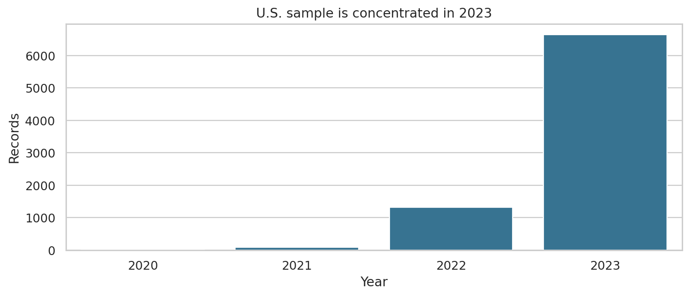
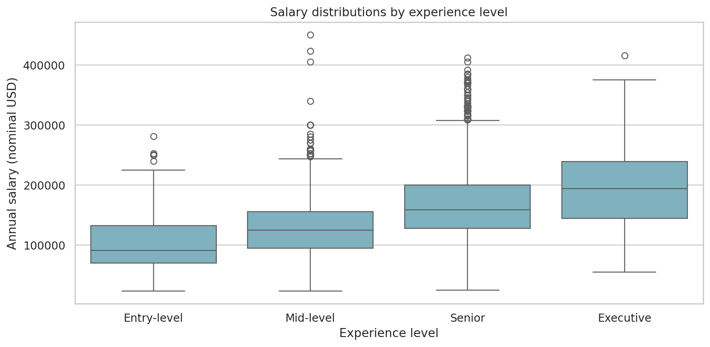
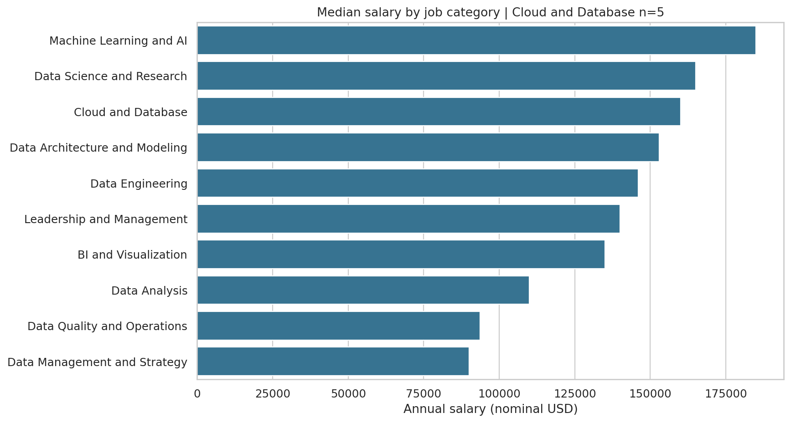
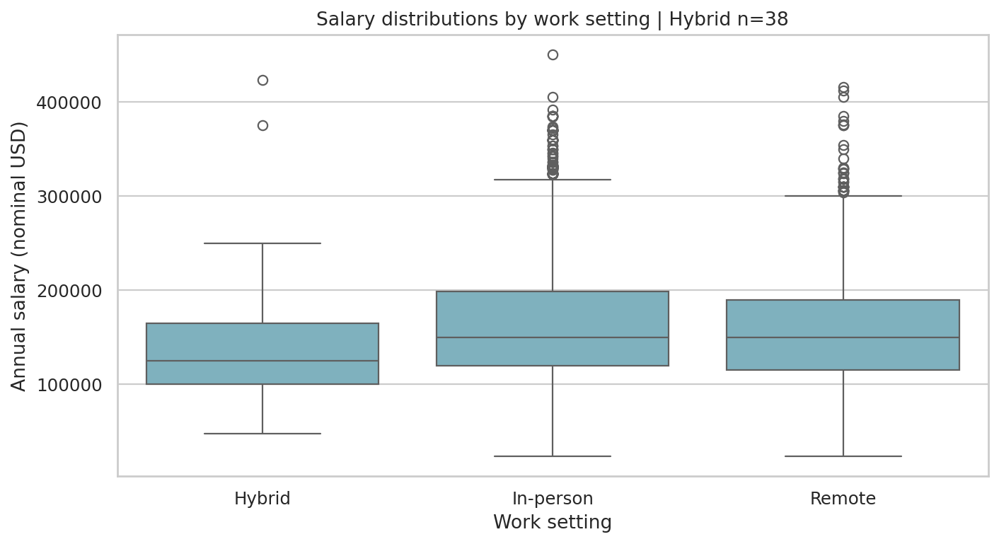
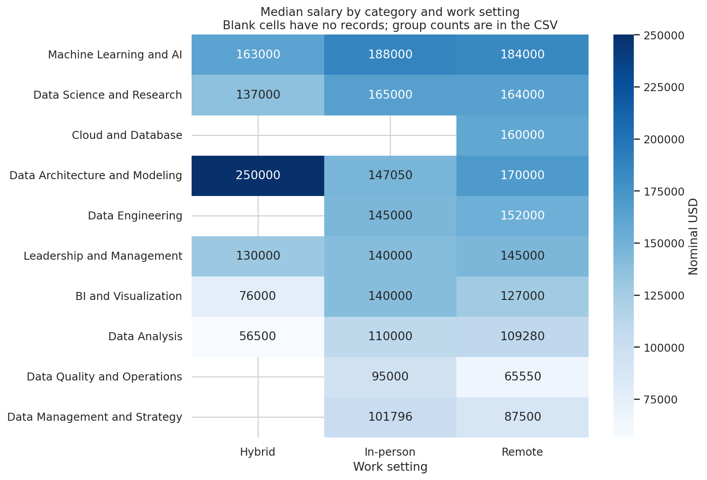
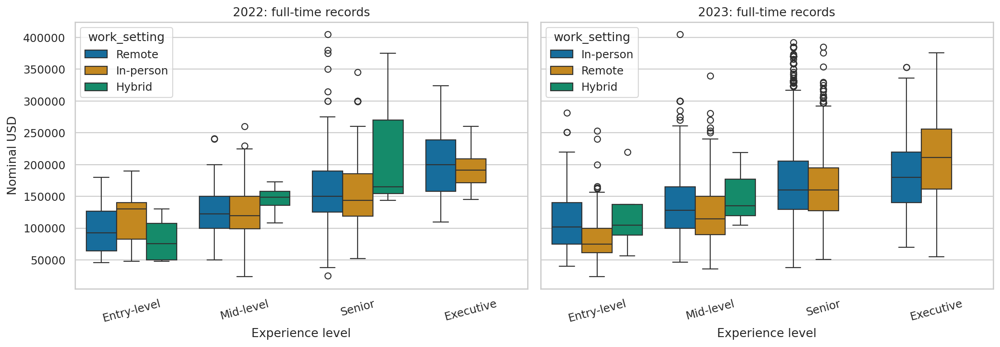
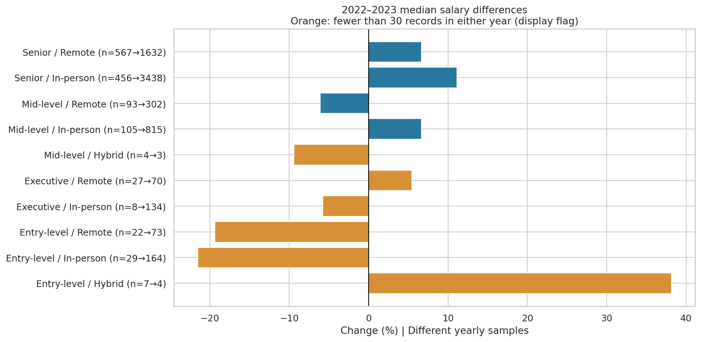
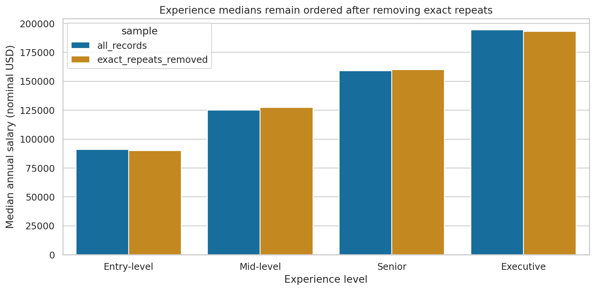

# Analysis Report

This report is generated from the executed analysis.

## Dataset

Source: [Jobs and Salaries in Data Science — Kaggle](https://www.kaggle.com/datasets/hummaamqaasim/jobs-in-data), Hummaam Qaasim.

The supplied historical CSV has **9,355 records and 12 columns**, covering 2020–2023. Selecting records where both the company and employee are located in the United States gives **8,080 records**, covering **101 job titles and 10 job categories**.

There are no missing values. All U.S. records use USD and their salary fields agree. Salaries are nominal; no inflation adjustment is applied.

| Year | Records | Share (%) |
|---|---|---|
| 2,020 | 28 | 0.35 |
| 2,021 | 87 | 1.08 |
| 2,022 | 1,323 | 16.37 |
| 2,023 | 6,642 | 82.20 |

**98.57%** of U.S. records come from 2022–2023. The small 2020 and 2021 samples limit four-year comparisons.

The global dataset contains **4,014 exact repeated rows**, including **3,831** within the U.S. subset. Without unique identifiers, repeats cannot be conclusively classified as erroneous duplicates. The main analysis retains them; a sensitivity analysis removes exact repeats across all original columns.

See [dataset documentation](../data/README.md) for attribution, fields, and ODbL/DbCL terms.

## Project Structure

| File or folder | Purpose |
|---|---|
| `OriginalCode.ipynb` | Executed notebook with explanations, tables, and charts |
| `scripts/run_analysis.py` | Reproducible analysis and output generation |
| `scripts/verify.py` | Checks source data, summaries, and generated files |
| `requirements.txt` | Versions used for execution |
| `data/` | Unchanged source CSV and dataset documentation |
| `results/tables/` | Eight CSV summaries and comparisons |
| `results/plots/` | Eight static charts |
| `results/job_distribution.html` | Interactive, self-contained Plotly visualization |
| `results/data_quality.json` | Validation counts and source checksum |
| `reports/analysis_report.md` | Methodology and research findings |

## Analysis Workflow

1. Validate required columns, numeric salary fields, missing values, and experience labels.
2. Select U.S.-based companies and employees, using `salary_in_usd` consistently.
3. Describe sample composition and salary distributions.
4. Compare salaries by experience, job category, and work setting.
5. Compare full-time 2022 and 2023 groups with both sample counts visible.
6. Compare results with and without exact repeated rows.
7. Export tables, static charts, and an interactive chart.

Experience levels are ordered Entry-level, Mid-level, Senior, Executive. Work settings are categorical. Arbitrary label codes are not used to infer salary effects. Missing comparison groups remain unavailable rather than being converted to zero salaries.

## Results

| Statistic | Annual salary |
|---|---:|
| Mean | $158,599 |
| Median | $150,000 |
| 25th percentile | $117,875 |
| 75th percentile | $192,000 |
| Minimum | $24,000 |
| Maximum | $450,000 |

## Research Questions and Answers

### 1. How do median salaries differ across experience levels?

| Experience | Records | Median (USD) | Mean (USD) |
|---|---|---|---|
| Entry-level | 327 | 91,000 | 104,849.01 |
| Mid-level | 1,371 | 125,000 | 130,431.59 |
| Senior | 6,138 | 159,095 | 166,277.89 |
| Executive | 244 | 194,500 | 195,731.13 |

Median salaries increase across the ordered experience groups. The executive median is approximately **2.14 times** the entry-level median. Senior records account for **75.97%** of this sample. This association does not isolate experience from job category or other characteristics.

### 2. How do salaries vary across job categories?

| Job category | Records | Median (USD) |
|---|---|---|
| Machine Learning and AI | 1,174 | 185,000 |
| Data Science and Research | 2,625 | 165,000 |
| Cloud and Database | 5 | 160,000 |
| Data Architecture and Modeling | 237 | 153,000 |
| Data Engineering | 1,969 | 146,000 |
| Leadership and Management | 439 | 140,000 |
| BI and Visualization | 288 | 135,000 |
| Data Analysis | 1,238 | 110,000 |
| Data Quality and Operations | 50 | 93,625 |
| Data Management and Strategy | 55 | 90,000 |

**Machine Learning and AI** has the highest median at **$185,000**. Cloud and Database has only five records, so its ranking is uncertain. These are unadjusted comparisons across different role and experience mixes.

### 3. What differences appear between remote, hybrid, and in-person records?

| Work setting | Records | Median (USD) | Mean (USD) |
|---|---|---|---|
| Hybrid | 38 | 125,000 | 142,176.32 |
| In-person | 5,169 | 150,000 | 160,910.61 |
| Remote | 2,873 | 150,000 | 154,657.09 |

Remote and in-person records share a **$150,000** overall median. Hybrid records have a **$125,000** median, based on only 38 observations.

Differences vary by category: remote Data Engineering records have a $152,000 median versus $145,000 in-person; Machine Learning and AI has $184,000 remote versus $188,000 in-person. The sample does not establish a universal remote-work premium or penalty, or the independent effect of work setting.

### 4. How did reported median salaries differ between 2022 and 2023?

Across all U.S. records, the median rose from **$142,127 to $151,600**, approximately **6.67%**. These are different samples, not tracked raises for the same employees.

The following comparison includes only full-time records:

| Experience | Work setting | 2022 n | 2023 n | 2022 median USD | 2023 median USD | Change (%) |
|---|---|---|---|---|---|---|
| Entry-level | Hybrid | 7 | 4 | 76,000 | 105,000 | 38.16 |
| Entry-level | In-person | 29 | 164 | 130,000 | 102,000 | -21.54 |
| Entry-level | Remote | 22 | 73 | 93,000 | 75,000 | -19.35 |
| Executive | In-person | 8 | 134 | 191,080 | 180,000 | -5.80 |
| Executive | Remote | 27 | 70 | 200,000 | 210,914 | 5.46 |
| Mid-level | Hybrid | 4 | 3 | 149,000 | 135,000 | -9.40 |
| Mid-level | In-person | 105 | 815 | 120,000 | 128,000 | 6.67 |
| Mid-level | Remote | 93 | 302 | 122,500 | 115,000 | -6.12 |
| Senior | Hybrid | 3 | — | 165,000 | — | — |
| Senior | In-person | 456 | 3,438 | 144,000 | 160,000 | 11.11 |
| Senior | Remote | 567 | 1,632 | 150,000 | 160,000 | 6.67 |

Senior in-person medians increased **11.11%** and senior remote medians **6.67%**. Entry-level in-person and remote medians decreased. Other comparisons differ by work setting.

The hybrid entry-level increase of **38.16%** compares seven records with four and is too fragile to interpret as broad market growth. Senior hybrid has no 2023 observations, so no change is calculated. Orange chart bars flag groups with fewer than 30 records in either year; this is a display rule, not a statistical significance threshold.

### 5. How sensitive are the findings to repeated records?

Removing exact repeats reduces the U.S. subset from **8,080 to 4,249 records**.

| Measure | All records | Exact repeats removed |
|---|---:|---:|
| Overall median | $150,000 | $150,000 |
| Overall mean | $158,599 | $158,554 |
| Entry-level median | $91,000 | $90,000 |
| Mid-level median | $125,000 | $127,288 |
| Senior median | $159,095 | $160,000 |
| Executive median | $194,500 | $193,250 |
| In-person median | $150,000 | $150,550 |
| Remote median | $150,000 | $150,000 |
| Hybrid median | $125,000 | $130,000 |

The overall median, increasing experience-level pattern, and highest-median category remain unchanged. Some subgroup values shift. See the [complete sensitivity table](../results/tables/duplicate_sensitivity.csv), which includes category and yearly summaries. This does not prove every repeated row is an erroneous duplicate.

## What We Achieved

- Built and executed a reproducible Python salary-analysis workflow.
- Analyzed **8,080 U.S. records** across experience levels, categories, work settings, and years.
- Answered five research questions with supporting figures and sample sizes.
- Generated **eight CSV tables, eight static charts, an interactive chart, and a data-quality summary**.
- Evaluated sensitivity to exact repeated rows.
- Documented limitations affecting interpretation.

## Limitations and Future Work

- The dataset is not established as representative of all U.S. data professionals.
- Years, experience levels, and work settings have unequal sample sizes.
- Identical records cannot be conclusively classified without unique identifiers.
- Salaries are nominal and do not account for inflation or living costs.
- Group differences are descriptive associations, not causal effects.
- Yearly comparisons can reflect changes in sample composition.
- The data covers 2020–2023 and is not a current salary benchmark.

Future work could examine inflation-adjusted comparisons, analyses controlling for job category and experience, and validation against additional datasets. No predictive model, spelling remediation, or outlier removal is claimed.

## Conclusion

The supplied U.S. sample shows higher median salaries across progressively senior experience groups. Machine Learning and AI has the highest category median. Remote and in-person records share the same overall median, while comparisons within categories vary.

Removing exact repeated rows preserves the main experience pattern and overall median. Small subgroups and unequal yearly samples limit broader conclusions. The project demonstrates data preparation, grouped analysis, visualization, and interpretation supported by sample sizes and sensitivity checks.
